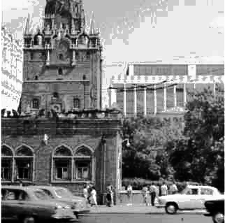
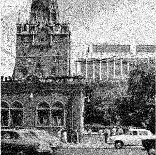
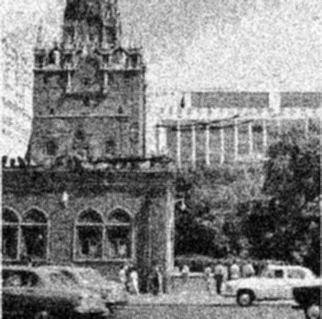
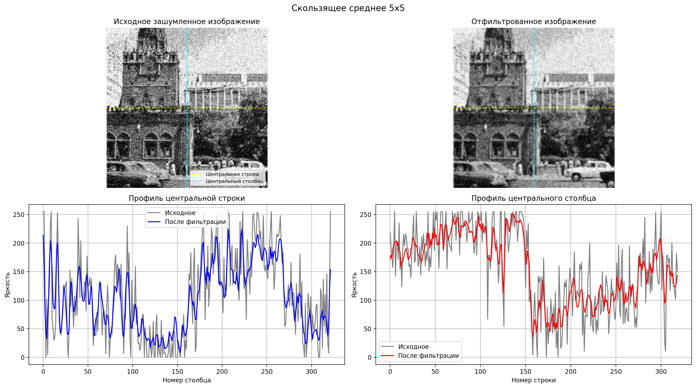
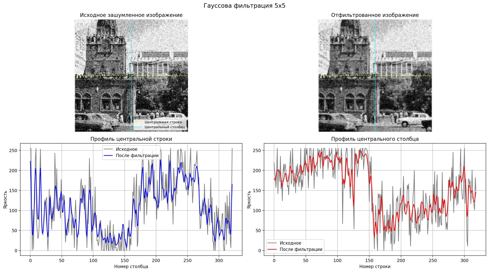

# Алгоритмы линейной фильтрации в пространственной области

## Исходное изображение

## Зашумленное изображение

## Фильтрация методом "скользящее среднее"

## Фильтрация методом "Гаусовская фильтрация"

## Анализ фильтрации методом "скользящее среднее"

## Анализ фильтрации методом "Гаусовская фильтрация"

